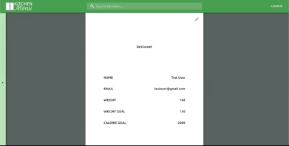

## ➤ Description

KitchenMenu is an application built with ExpressJS & React, and uses the Spoonacular API to allow users to not only search for recipes to make, but also track the meals they end up eating. They can filter their results by macronutrient quantities, dietary restrictions and selected ingredients.

Link: https://kitchenmenu-client.herokuapp.com/

[](#installation)

## ➤ Installation (npm)

```
npm install
```

[](#features)

## ➤ Features

### Register


### Login


### Search by ingredients


### Filter by diets and macros


### Bookmark/Unbookmark recipes


### Edit user info



### Track nutritional data


